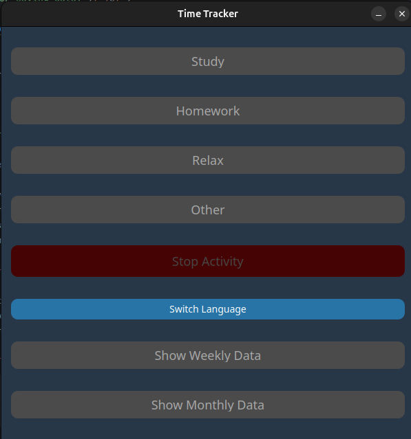
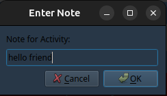
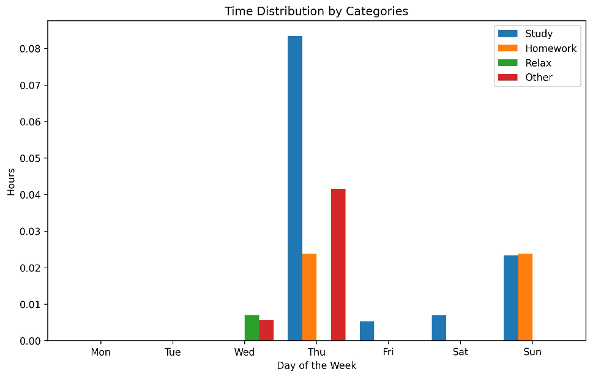
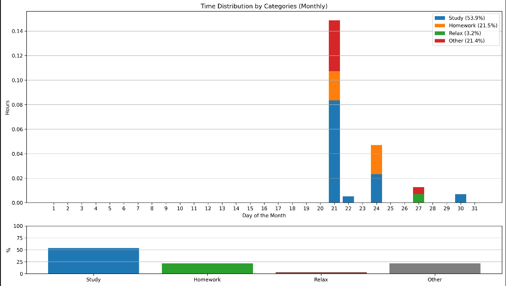

# Time-Tracker
This GUI application is built with PyQT5 & Matplotlib to track the time spent on various routine tasks.
The app automatically saves data to a JSON file, allowing for statistical visualization in the form of charts/diagrams.

****

## Installation

1. Ensure Python is installed on your system. If not, you can download it [here](https://www.python.org/). Python version 3.8 or higher is required.
2. Install the required libraries:
`pip install -r requirements.txt`
3. Clone the repository: `git clone https://github.com/cyweee/Time-Tracker.git`
4. Navigate to the cloned repository: `cd Time-Tracker`
****

## Usage

The main script of the application is `trackerapp.py`



1. **Select an activity and add a note to it**



Once the note is added, the script will start tracking the time spent on the selected activity.
When you finish working, the data will be automatically saved to `activities.json`

2. **Saving data**

The application saves activity data to the `activities.json` file using the `save_to_json` function.
This function takes the following parameters:
- `activity_key` - The name of the activity (string).
- `start_time` - The start time of the activity (datetime object).
- `end_time` - The end time of the activity (datetime object).
- `duration` - The duration of the activity (timedelta object).
- `note` - The user’s note for the activity (string).

### How the `save_to_json` function works

2.1 **Reading the file**

The function tries to open and load data from the `activities.json` file. If the file is not found or is corrupted, a new data structure is created:
```
{
    "activities": []
}
```
2.2 **Adding an activity**

The function adds the new activity to the activities list in the following format:

```
[
    {
        "name": "Example", // Activity category
        "start": "2024-11-23T10:00:00", // Start time (ISO 8601)
        "end": "2024-11-23T11:00:00", // End time (ISO 8601)
        "duration": "1:00:00", // Duration
        "note": "Example" // Note (optional)
    }
]
```

2.3 **Error handling**

If an error occurs while saving the data, the user will be notified

3. **Visualization of statistics**

The application uses two scripts to visualize the time spent in different categories:

**`weekly_stats.py` for weekly statistics**



This script visualizes time distribution for the current week, showing how much time was spent on each category for each day of the week.
The `activities.json` file is cleared every Sunday to begin tracking data for a new week automatically.

**`monthly_stats.py` for monthly statistics**



This script analyzes data from `activities.json`, groups it by days of the month, and generates two charts:

- A chart showing time distribution per category (e.g., study, relax, homework, etc.) for each day of the month.
- A chart displaying the percentage of time spent on each activity.

4. **Language settings**

The default language of the application is Russian. If you want to set English as the default language, follow these steps:

4.1  Open the `trackerapp.py` script

4.2 Find the line `self.current_language = "ru"`

4.3 Replace "ru" with "en": `self.current_language = "en"`

You will also need to update the language setting for the chart scripts. Locate the line `current_language = "ru"` and replace it with `current_language = "en"`

**How the translation system works:**

The app uses a `translations` dictionary to store text translations for different interface elements in both Russian and English. This dictionary contains translations for:
- Chart titles.
- Axis labels.
- Activity categories.

Example:
```
translations = {
    "ru": {
        "title": "Распределение времени по категориям",
        "x_label": "День недели",
        "y_label": "Часы",
        "categories": {
            "study": "Учеба",
            "homework": "Дз",
            "relax": "Отдых",
            "other": "Другое"
        },
        "days": ["ПН", "ВТ", "СР", "ЧТ", "ПТ", "СБ", "ВС"]
    },
    "en": {
        "title": "Time Distribution by Categories",
        "x_label": "Day of the Week",
        "y_label": "Hours",
        "categories": {
            "study": "Study",
            "homework": "Homework",
            "relax": "Relax",
            "other": "Other"
        },
        "days": ["Mon", "Tue", "Wed", "Thu", "Fri", "Sat", "Sun"]
    }
}
```
When the language is set to English, all charts and the interface will appear in English, using translations from the `translations` dictionary.

5. **Exporting data**

The application allows you to export visualized data as charts saved in JPG format. This feature helps store the statistics in an easily viewable format or use them in other applications.
- To export statistics, use scripts like `weekly_stats.py` or `monthly_stats.py`
- In these scripts, you can specify the path where the JPG image will be saved.
- Example of saving a chart:
`output_file = "path_to_save_image/your_stats.jpg"`

****

## Future development

This project will continue to improve. Feel free to report bugs or suggest features in the Issues section.

****

## Additional information

If you need, you can read this [documentation](https://github.com/cyweee/Time-Tracker/tree/main/doc) in Russian language

****

## Authors

This project was developed by Buryk Kyrylo for practice in Python programming.