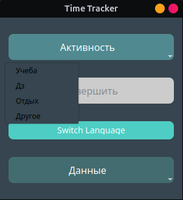
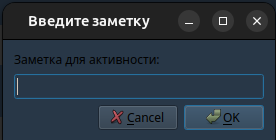
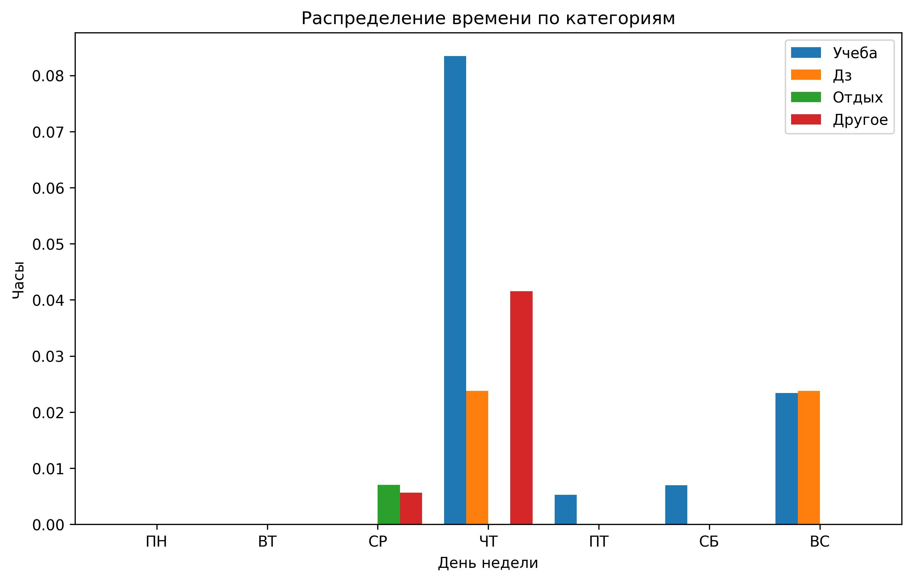
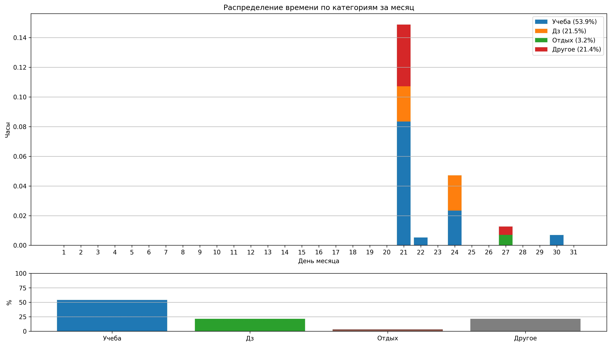

# Трекер-Времени

Это GUI приложение разработано с помощью PyQT5 & Matplotlib, для отслеживания времени потраченного на разные рутинные задачи.
Приложение автоматически сохраняет данные в json файл для предоставления визуализации статистки в виде графиков/диаграмм

****

## Установка

1. На компьютере должен быть установлен интерпретатор Python, если же его нет то его можно установить [тут](), надо иметь как минимум версию 3.8
2. Для установки необходимых библиотек
```pip install -r requirements.txt```
3. Клонируйте репозиторий 
```git clone https://github.com/cyweee/Time-Tracker.git```
4. Перейдите в каталог с клонированным репозиторием:
```cd Time-Tracker```

****

## Использование 

Основным скриптом считается файл `trackerapp.py`



1.**Выберите активность которой вы хотели бы заняться и добавьте к ней заметку**



После добавления заметки, скрипт начнет засекать время в активности в которой вы проводите время

По окончании работы скрипта, данные автоматически сохранятся в `activities.json`

2. **Сохранение данных**

Приложение сохраняет данные об активности в файл `activities.json`, сохранение происходит с помощью функции `save_to_json`
она принмает следующие параметры:
- `activity_key` - Название активности (строка)
- `start_time` - Время начала активности (объект `datetime`)
- `end_time` - Время окончания активности (объект `datetime`)
- `duration` - Продолжительность активности (объект `timedelta`)
- `note` - Заметка пользователя к активности (строка)

### Как работает функция save_to_json

2.1 **Чтение файла**

Попытка открыть и загрузить данные из файла `activities.json`. Если файл не найден или он был поврежден, создаётся новая структура данных:

```
{
    "activities": []
}
```

2.2 **Добавление активности**

Информация о новой активности добавляется в список `activities` в формате:

````
[
    {
        "name": "Пример", // Название категории
        "start": "2024-11-23T10:00:00", // Время начала (ISO 8601)
        "end": "2024-11-23T11:00:00", // Время окончания (ISO 8601)
        "duration": "1:00:00", // Длительность
        "note": "Пример" // Примечание (необязательно)
    }
]
````

2.3 **Ошибки**

Если произошла ошибка при сохранении данных, пользователю выводится сообщение об ошибке


3. **Визуализация статистики**

Для визуализации данных о времени, проведенном в разных категориях, используются два скрипта:

**weekly_stats.py — статистика за неделю**



Скрипт визуализирует распределение времени за текущую неделю. Он создает график, показывающий, сколько времени было потрачено каждой категорией в разные дни недели.
Особенность этого сценария в том, что каждую неделю данные в файле `activities.json` очищаются, чтобы начать подсчет для новой недели. Это гарантирует, что статистика за каждую неделю будет актуальной. Данные автоматически очищаются каждое воскресенье.

**monthly_stats.py — статистика за месяц**



Этот скрипт анализирует данные из activities.json, группирует их по дням месяца и строит два графика:

- График распределения времени по дням месяца для каждой категории (учеба, отдых, дз и т.д.).
- График процентного распределения времени между активностями.

Скрипт помогает анализировать, сколько времени было потрачено на разные категории в течение месяца.

4. **Настройка языка**

По умолчанию в приложении используется русский язык. Однако, если вы хотите, чтобы по умолчанию использовался английский язык, вам нужно внести несколько изменений в код.

4.1 Откройте скрипт `trackerapp.py`

4.2 Найти строку `self.current_language = "ru"`

4.3 Замените "ru" на "en", чтобы установить английский язык по умолчанию: `self.current_language = "en"`

Аналогичное изменение нужно будет сделать и в коде, который отвечает за графики. Найдите строку: `current_language = "ru"` и замените её на: `current_language = "en"`

**Как работает система перевода:**

В коде предусмотрен словарь `translations`, который хранит переводы всех текстовых элементов интерфейса для разных языков (для русского и английского). В этом словаре хранятся переводы для:
- Заголовков графиков
- Подписей осей
- Категорий времени

Пример перевода:
```
translations = {
    "ru": {
        "title": "Распределение времени по категориям",
        "x_label": "День недели",
        "y_label": "Часы",
        "categories": {
            "study": "Учеба",
            "homework": "Дз",
            "relax": "Отдых",
            "other": "Другое"
        },
        "days": ["ПН", "ВТ", "СР", "ЧТ", "ПТ", "СБ", "ВС"]
    },
    "en": {
        "title": "Time Distribution by Categories",
        "x_label": "Day of the Week",
        "y_label": "Hours",
        "categories": {
            "study": "Study",
            "homework": "Homework",
            "relax": "Relax",
            "other": "Other"
        },
        "days": ["Mon", "Tue", "Wed", "Thu", "Fri", "Sat", "Sun"]
    }
}

```

Сейчас если вы установили язык по умолчанию на английский, то все графики и интерфейс будут отображаться на английском, используя переводы из словаря `translations`

5. Экспорт данных 

Приложение позволяет экспортировать визуализированные данные в виде графиков, которые сохраняются в формате изображения (JPG). Это позволяет сохранить статистику в удобном для просмотра виде или использовать изображения в других приложениях.
- Для экспорта статистики необходимо использовать скрипты, такие как `weekly_stats.py` или `monthly_stats.py`
- В этих скриптах можно указать путь для сохранения изображения в формате JPG
- Пример кода для сохранения графика:
`output_file = "path_to_save_image/your_stats.jpg"`

****

## Будущее проекта

Проект будет продолжать развиваться. Сообщать о багах и предложениях можно в разделе Issues.

****

## Авторы

Этот проект был разработан Буриком Кириллом в целях практики программирования на языке python