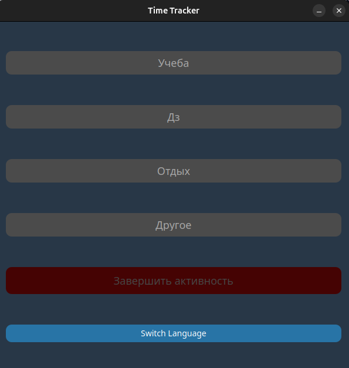

# Трекер-Времени

Это GUI приложение разработано с помощью PyQT5 & Matplotlib, для отслеживания времени потраченного на разные рутинные задачи.
Приложение автоматически сохраняет данные в json файл для предоставления визуализации статистки в виде графиков/диаграм

## Установка

1. На компьютере должен быть установлен интерпитатор Python, если же его нет то его можно установить [тут](), надо иметь как минимум версию 3.8
2. Для установки необходимых библиотек
```pip3 install -r requirements.txt```
3. Клонируйте репозиторий 
```git clone https://github.com/cyweee/Time-Tracker.git```
4. Перейдите в каталог с клонированным репозиторием:
```cd Time-Tracker```

## Использование 

Основным скриптом считается файл `trackerapp.py`



1.**Выберите активность которой вы хотели бы заняться и добавьте к ней заметку**


После добавления заметки, скрипт начнет засекать время в активности в которой вы проводите время

По окончании работы скрипта, данные автоматически сохранятся в `activities.json`

2. **Сохранение данных**

Приложение сохраняет данные об активности в файл `activities.json`, сохранение происходит с помощью функции `save_to_json`
она принмает следующие параметры:
- `activity_key` - Название активности (строка)
- `start_time` - Время начала активности (объект `datetime`)
- `end_time` - Время окончания активности (объект `datetime`)
- `duration` - Продолжительность активности (объект `timedelta`)
- `note` - Заметка пользователя к активности (строка)

### Как работает функция save_to_json

2.1 **Чтение файла**

Попытка открыть и загрузить данные из файла `activities.json`. Если файл не найден или он был поврежден, создаётся новая структура данных:

```
{
    "activities": []
}
```

2.2 **Добавление активности**

Информация о новой активности добавляется в список `activities` в формате:

````
[
    {
        "name": "Пример",
        "start": "2024-11-23T10:00:00",
        "end": "2024-11-23T11:00:00",
        "duration": "1:00:00"
        "note": "Пример"
    }
]
````

2.3 **Ошибки**

Если произошла ошибка при сохранении данных, пользователю выводится сообщение об ошибке


3. **Визуализация статистики**

